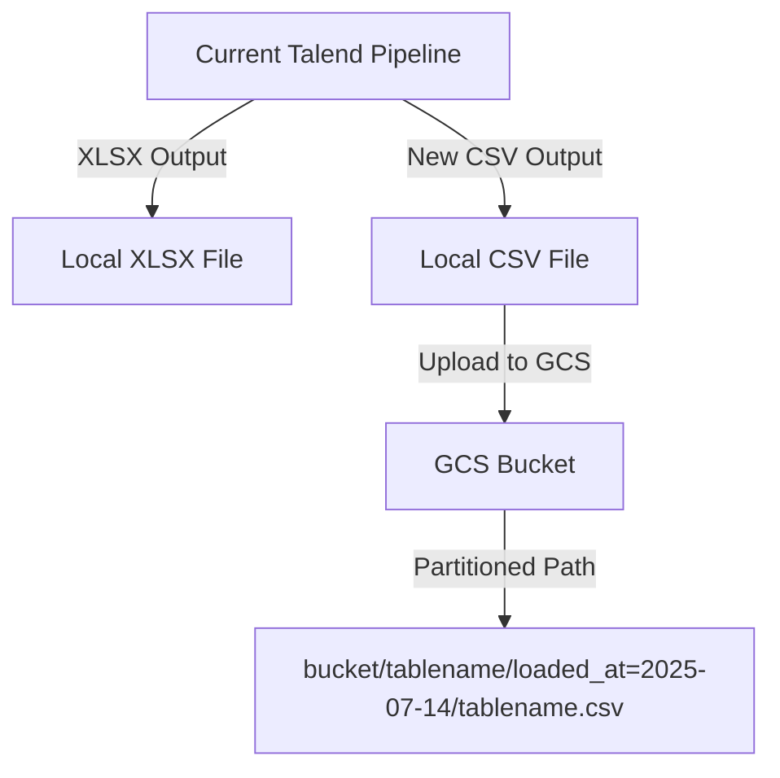

# Talend Pipeline Migration Path: XLSX to CSV in GCS

## Overview
Currently, the Talend pipeline outputs an `.xlsx` file. To streamline integration with BigQuery, the migration path proposes outputting a `.csv` file directly to Google Cloud Storage (GCS), following a partitioned path structure. This enables BigQuery to read the data natively using external tables.

## Migration Path

## Details
- **Current State:**
  - Talend pipeline outputs `.xlsx` files locally.
- **Proposed State:**
  - Add a new output in the Talend pipeline to generate `.csv` files.
  - Output can be saved locally or pushed directly to a GCS bucket using a user or service account.
  - Use the following GCS path structure:
    - `<bucket>/<tablename>/loaded_at=<date>/<filename>.csv`
  - BigQuery can then create external tables referencing these CSV files for native querying.

## Benefits
- No changes required to the existing pipeline logic.
- Simplifies BigQuery integration (native CSV support).
- Enables partitioned data management in GCS.

---

*Document generated on 2025-07-14.*
